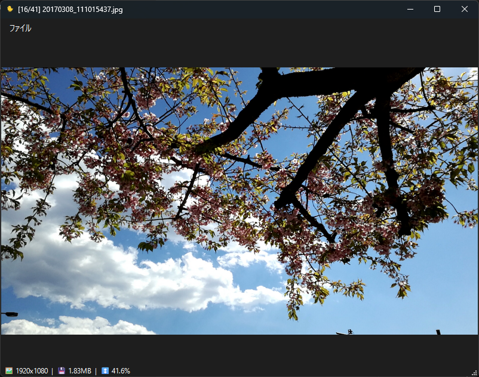

# ひよこビューア (Hiyoko Viewer)

## 概要

ひよこビューアは、PythonとPyQt6で作成された、画像の高速な鑑賞と選別に特化したクロスプラットフォーム対応の画像ビューアです。

特に大容量の画像でもストレスなく閲覧できるよう、非同期読み込みや永続的なワーカースレッドなどの技術を採用しています。チラつきのないスムーズなブラウジング体験と、キーボード中心の高速な画像選別ワークフローを提供します。

## 主な機能

- **高速なブラウジング:** 次の画像が読み込まれるまで現在の画像を表示し続けることで、チラつきのないスムーズな画像切り替えを実現。
- **多彩なフォーマット対応:** 一般的な画像フォーマット（PNG, JPEG, GIF, WebP, SVGなど）に幅広く対応。
- **GIFアニメーション再生:** GIFアニメの再生、一時停止、コマ送りに対応。
- **直感的な操作:**
  - ドラッグ＆ドロップによる画像読み込み。
  - マウスカーソル位置を中心としたスムーズなズーム。
  - スペースキー＋ドラッグによるパン操作（ハンドツール）。
- **高速な画像選別:**
  - `_ok` / `_ng` フォルダへのワンキーでの画像移動。
  - `Delete`キーによる安全なごみ箱への移動（確認ダイアログなし）。
- **鑑賞支援機能:**
  - フルスクリーン表示。
  - フォルダ内の画像のランダム表示（シャッフル）。

## ショートカットキー一覧

### ナビゲーション
| キー                        | 機能                               |
| --------------------------- | ---------------------------------- |
| `→` / `Page Down`          | 次の画像へ（フォルダ内をループ）   |
| `←` / `Page Up`            | 前の画像へ（フォルダ内をループ）   |

### 表示モード
| キー                        | 機能                               |
| --------------------------- | ---------------------------------- |
| `F`                         | フィット表示 ⇔ 原寸(100%)表示 の切替 |
| `F11`                       | フルスクリーン表示の切替           |
| `Ctrl` + `マウスホイール`   | カーソル位置を中心にズームイン/アウト |
| `Space` + `左ドラッグ`      | パン操作（画像のドラッグ移動）     |
| `マウスホイール`            | 垂直スクロール                     |
| `Shift` + `マウスホイール`  | 水平スクロール                     |

### ファイル操作
| キー                        | 機能                               |
| --------------------------- | ---------------------------------- |
| `テンキー 7`                | `_ok` フォルダに画像を移動         |
| `テンキー 9`                | `_ng` フォルダに画像を移動         |
| `Delete`                    | ファイルをごみ箱に移動（確認なし） |

### GIFアニメーション操作
| 操作                        | 機能                               |
| --------------------------- | ---------------------------------- |
| 画像上を`左クリック`        | 再生 / 一時停止 の切替             |
| `.` (ピリオド)              | 次のフレームへ（コマ送り）         |

### その他
| キー                        | 機能                               |
| --------------------------- | ---------------------------------- |
| `R`                         | ランダム（シャッフル）表示の切替   |
| `I`                         | メタデータ表示   |
| `Esc`                       | ウィンドウを閉じてトレイに格納（完全終了はトレイ右クリック > 完全に終了）|

## アップグレード時の注意

v1.x 以前では設定（ウィンドウサイズ等）を `./settings` フォルダに保存していました。
現在は Qt 標準のユーザー設定領域（Windows: レジストリの `HKCU\Software\HiyokoSoft\HiyokoViewer`）を使用します。
旧設定は自動移行されないため、初回起動時にウィンドウ位置がリセットされる場合があります。

## プロジェクト構成と起動方法

ソースは `src/` レイアウトのパッケージ `hiyoko_viewer` に分割しています。

```text
src/hiyoko_viewer/
├── app.py            # 起動処理（二重起動防止 / インスタンス間通信）
├── __main__.py       # python -m hiyoko_viewer の入口
├── config/           # 定数
├── core/             # Qt 非依存のロジック（metadata / sorting / resources）
├── services/         # バックグラウンド処理（image_loader）
├── ui/               # 画面（main_window と mixins, dialogs）
└── assets/           # 同梱リソース（app_icon.ico）
```

起動方法は次の4通りをサポートします。アイコン等のリソースはいずれの形態でも
解決できるよう、PyInstaller 実行時は `sys._MEIPASS`、それ以外は同梱した
`hiyoko_viewer.assets` を基準にします。

| 形態 | コマンド | 用途 |
| --- | --- | --- |
| 開発実行 | `python main.py` | リポジトリ直下からそのまま起動 |
| モジュール実行 | `python -m hiyoko_viewer` | `src` を `PYTHONPATH` に通して起動 |
| インストール後 | `pip install .` 後に `hiyoko-viewer` | console-script として起動 |
| 配布バイナリ | `dist/hiyoko-viewer.exe` | PyInstaller でビルドした exe |

## ビルド方法

このアプリケーションはPyInstallerを使ってWindows向けの実行可能ファイルに変換できます。

```bash
python -m venv .venv
.venv\Scripts\activate
pip install -r requirements-build.txt
.\make_build.bat
```

- ビルドが完了すると、`dist` フォルダ内に `hiyoko-viewer.exe` と `_internal`フォルダが生成されます。
- `C:\Program Files\hiyoko-viewer` を作成してそこにコピーし、`"C:\Program Files\hiyoko-viewer\hiyoko-viewer.exe"`などとなることを確認
- （`register_app.reg` は用意したけどなんか上手く動かないので、png,jpg,gif,webpあたりを1つずつ手動で登録したほうが早いかも）

## 開発・品質チェック

開発用の依存関係を含めてセットアップします。

```bash
python -m venv .venv
.venv\Scripts\activate
pip install -r requirements-dev.txt
pre-commit install
```

ローカルでの主な確認コマンド:

```bash
ruff check .
ruff format --check .
pytest
pre-commit run --all-files
```

まとめて実行する場合:

```powershell
.\scripts\check.ps1
```

`.\scripts\check.ps1 -SkipPreCommit` で `pre-commit run --all-files` だけ省略できます。
ステージ済み差分も `git diff --cached --check` で確認したい場合は `.\scripts\check.ps1 -CheckStaged` を使います。

`pytest` は `pytest-cov` を通してカバレッジも出力します。GitHub Actions でも同じ lint / format / test を実行します。


## LICENSE

MIT.
